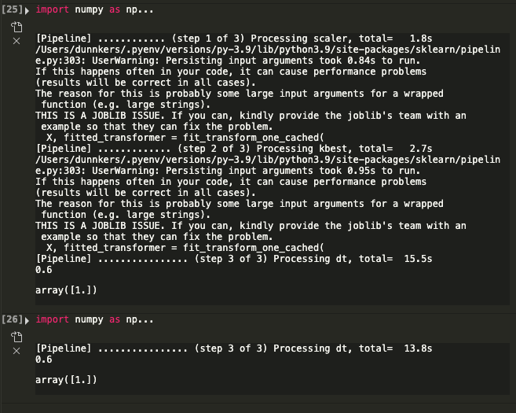

Result: **works**, but is too inefficient.

Above pic: full pipeline is ran, on `n=500,000` samples. Below: caching is used, many steps are skipped, except the final one.

### Caveats
1. **Entire** dataset is checked: this can take a long time for large datasets.
2. The last step seems to be always executed.

